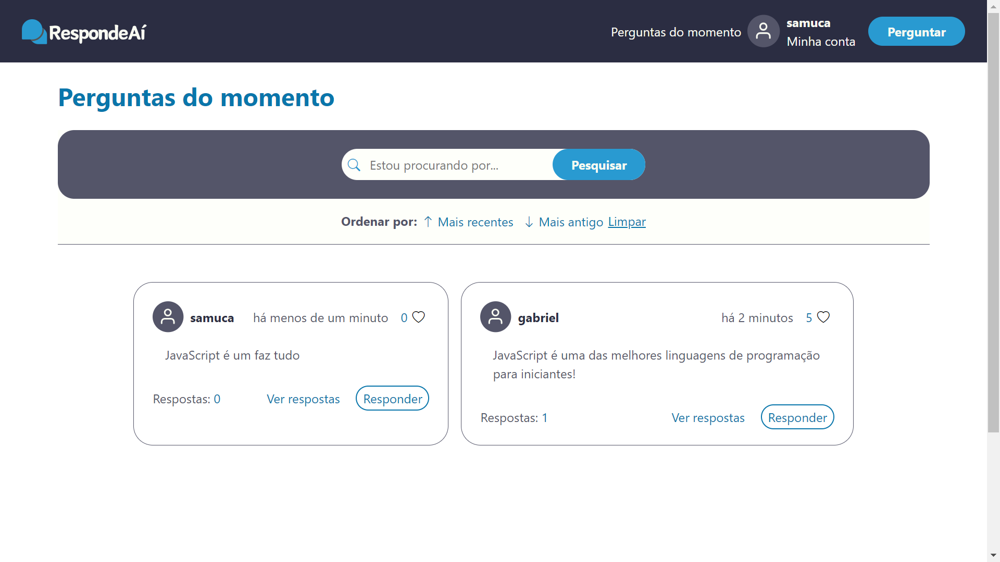

# RespondeAi
O RespondeAi foi desenvolvido como uma plataforma inclusiva e interativa, destinada a criar uma comunidade onde a troca de perguntas e respostas se torna uma experiência enriquecedora. A ideia principal é proporcionar um ambiente acolhedor e aberto, onde qualquer pessoa se sinta encorajada a compartilhar suas dúvidas, curiosidades e questões, independentemente de sua natureza ou complexidade. A sua abordagem é semelhante ao antigo Yahoo Respostas, onde qualquer pessoa pode fazer uma pergunta e outras pessoas de qualquer lugar do mundo podem responder.

Para executar o projeto, vá para o último tópico: <a href="##getting-started">🚀 Getting started</a>.

## 🎨 Layout


## ⚙️ Descrição do projeto

O projeto FullStack está completamente funcional, integrando um FrontEnd dinâmico e responsivo desenvolvido com Handlebars e estilizado com Bootstrap. O BackEnd utiliza o Express, junto ao Sequelize (MySQL) como banco de dados para uma eficiente manipulação de dados. A segurança é assegurada com a utilização do bcrypt para autenticação de usuários, garantindo o armazenamento seguro e a proteção das credenciais no sistema. A aplicação possui dois CRUD completos, um para as perguntas e outro para os usuários.

No total, há 8 páginas, cada uma com as suas próprias funcionalidades, sendo elas: Home, Signin, Signup, Read Question, Create Question, Edit Question, User Informations e User Question.

## 💻 Tecnologias

- JavaScript
- Express
- Handlebars
- Bootstrap
- Sequelize
- MySQL
- Bcrypt (Auth)


<h2 id="#getting-started">🚀 Getting started (Uso local)</h2>

 Para funcionar tudo corretamente, antes de iniciar o projeto, é necessário iniciar o mysql através do XAMPP (ou plataforma de sua preferência), como também criar o banco de dados através do MySQL WorkBench (ou plataforma de sua preferência), nomeado como: "respondeai". Após essas etapas, siga os passos abaixos para execução do projeto.

<h4>1 - Baixando o projeto</h4>

Selecione um local de preferência, abra o terminal neste local e execute o seguinte comando:

```bash
git clone https://github.com/gabriel-augg/respondeai
```

<h4>2 - Baixando as dependências</h4>

No mesmo terminal onde foi executado o comando anterior, digite o seguinde comando:

```bash
npm install
```

<h4>3 - Iniciando o projeto</h4>

No mesmo terminal, execute o seguinte comando:

```bash
npm start
```
<h4>4 - Acessando o RespondeAi</h4>
Após a sguir todos esses passos, abra o seguinte link no navegador de preferência: 

http://localhost:3000/


 
